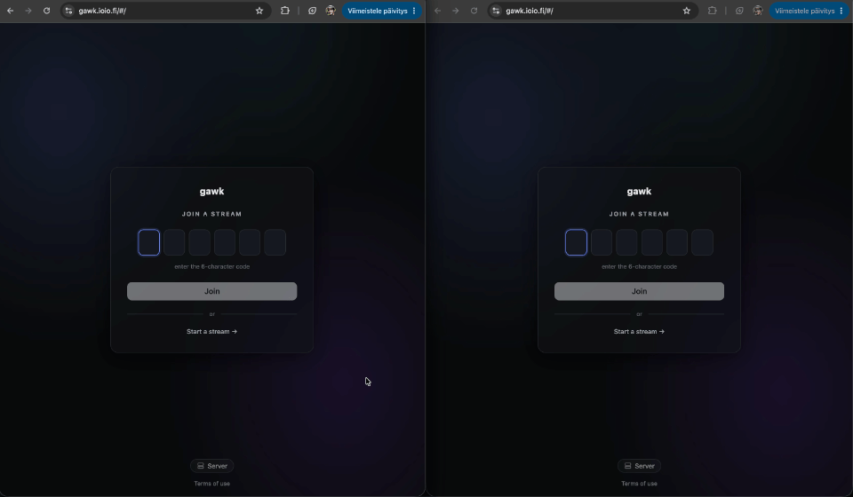
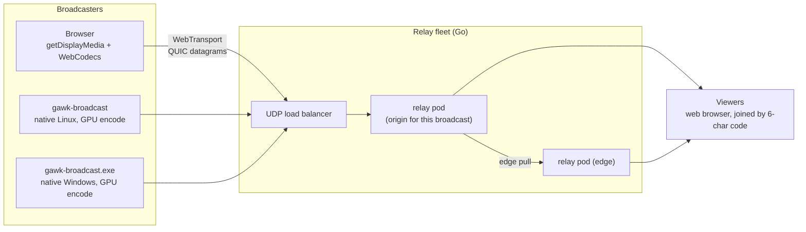

# gawk

[](https://github.com/Tuhis/gawk/actions/workflows/ci.yml)
[](https://github.com/Tuhis/gawk/actions/workflows/broadcast-windows.yml)
[](LICENSE)

[](https://github.com/Tuhis/gawk/releases)
[](https://github.com/Tuhis/gawk/releases)
[](https://github.com/Tuhis/gawk/releases)
[](https://github.com/Tuhis/gawk/releases)
[](https://github.com/Tuhis/gawk/releases)

Self-hosted, low-latency live game streaming for the browser. A broadcaster
shares their screen; viewers join with a 6-character code and watch at
**sub-500 ms glass-to-glass latency** (≈50 ms measured on a hardware
encode/decode path) — no accounts, no plugins, no native app required.

<!-- DEMO GIF PLACEHOLDER ──────────────────────────────────────────────────
  Replace this block with:   

  What to capture (the single highest-impact asset in this README):
  - Two windows side by side: broadcaster sharing a screen that shows a
    running millisecond stopwatch (e.g. a game + an on-screen timer), and a
    viewer tab playing it. The visible clock delta IS the latency proof.
  - Show the join flow: code appears on the broadcaster, viewer types it.
  - ~10–15 s loop, ≤ 900 px wide, ≤ 10 MB (GitHub renders GIFs inline;
    keep it small so the page stays fast).
  - Record with any screen recorder; convert with e.g.
    `ffmpeg -i demo.mp4 -vf "fps=12,scale=900:-1" docs/assets/demo.gif`
    (or use Kap/Peek/LICEcap which export GIF directly).
  - Commit the file as docs/assets/demo.gif.
──────────────────────────────────────────────────────────────────────── -->
> 📸 **Demo GIF coming here** — broadcaster and viewer side by side, clock
> visible on both, showing the actual glass-to-glass latency.

**[gawk.ioio.fi](https://gawk.ioio.fi)** runs this exact stack. This
repository is everything needed to run your own: two Helm charts, two
images, and a **[self-hosting guide](docs/self-hosting.md)**.

## Features

- **Sub-500 ms latency** — WebTransport datagrams + WebCodecs, tuned to
  favor dropped frames over stalled playback
- **Join by code** — no accounts, no installs for broadcasters or viewers
- **Scales horizontally** — a self-federating relay fleet carries hundreds
  of broadcasts and ~1,000 viewers on a single hot broadcast
- **Native broadcasters** for Linux and Windows with true hardware encode
  (the browser cannot hardware-encode on Linux — [why](docs/19-linux-native-broadcaster.md))
- **System and per-application audio**, Opus, synchronized off a shared clock
- **Resilience opt-ins** — reliable carrier streams, a relay-side DVR
  buffer, and forward parity for lossy viewer links
- **Optional telemetry** — per-session diagnostics with a dashboard and an
  MCP surface, off by default
- **Self-hosting first** — Helm charts + GHCR images, single node to
  multi-pod cluster

**Browser support:** Chromium-first. Firefox works through documented
fallbacks. **WebKit — Safari on every OS, and every browser on iOS — cannot
currently join a broadcast**: it refuses the WebTransport session outright
(see [BUGS.md](BUGS.md)), so the app detects it on load and warns. The iPhone
fMP4 + `ManagedMediaSource` playback path
([docs/27](docs/27-ios-mse-fullscreen.md)) is unchanged and still documented,
but nothing reaches it until that is resolved.

## Quick links

| | |
|---|---|
| **Run it yourself** | [`docs/self-hosting.md`](docs/self-hosting.md) — DNS, TLS, single-node and cluster mode |
| **Local dev in 5 minutes** | [Quickstart](#quickstart-local-dev) below |
| **How it works** | [below](#architecture), then [`docs/`](docs/README.md) — 41 design docs, one per milestone |
| **What's built, what's next** | [`ROADMAP.md`](ROADMAP.md) |
| **Known bugs** | [`BUGS.md`](BUGS.md) |
| **Gotchas** | [`docs/gotchas.md`](docs/gotchas.md) |
| **Contributing** | [`CONTRIBUTING.md`](CONTRIBUTING.md) · [`CODE-REVIEW.md`](CODE-REVIEW.md) |
| **Security** | [`SECURITY.md`](SECURITY.md) |

## Architecture



Every relay pod serves any viewer: the load balancer lands a connection
wherever, and a pod that isn't the broadcast's origin pulls the stream
from the pod that is ("edge pull").

The pipeline in one breath: capture → WebCodecs `VideoEncoder` → chunk into
≤ 1200-byte datagrams → relay fans out → reassemble → `VideoDecoder` →
canvas.

Design points worth knowing up front:

- **Transport is QUIC datagrams, not streams.** A lost chunk means a
  dropped frame, never stalled playback. Keyframes ride reliable streams.
- **The relay is a byte forwarder** that caches the latest decoder config
  and keyframe, so late joiners get a picture immediately.
- **One frozen wire format, four implementations** — Go (the source of
  truth), TypeScript, and the two native broadcasters — kept byte-compatible
  by shared golden test vectors.
- **Codec is negotiated, not fixed** — H.264 hardware realtime is the happy
  path, with VP9/VP8 fallbacks.
- **Why not WebRTC/SFU?** Deliberate choice: a lower-level, self-owned
  pipeline over a mature but heavier stack, partly as a real exploration of
  newer browser transport and codec APIs. The trade-offs are discussed in
  [`docs/README.md`](docs/README.md).

## Quickstart (local dev)

Prerequisites: Go ≥ 1.26, Node ≥ 22, a Chromium-based browser.

```sh
# 1. Relay with an ephemeral dev certificate
cd gawk-server
go run ./cmd/gawk-server -dev-cert
#    → copy cert_hash_hex from the startup log

# 2. Frontend
cd gawk-app
npm install
npm run dev            # http://localhost:5173
```

Open `http://localhost:5173/#/broadcast`, paste the cert hash into the
**⚙ settings** panel, click **Start a stream**, and pick a screen — you get
a 6-character code. Open the join link in another tab and it connects. No
Chrome flags needed.

Run the test suites:

```sh
cd gawk-server && go vet ./... && CGO_ENABLED=1 go test -race ./...
cd gawk-app    && npm test && npm run lint && npm run build
```

Browser E2E (a real headless-Chrome viewer decoding real relayed frames)
runs on every PR; see [`e2e/README.md`](e2e/README.md) to run it locally.

## Run your own

Two Helm charts, two images, published to GHCR on every release with chart
version, `appVersion` and image tag always in lockstep:

```sh
helm upgrade --install gawk-server oci://ghcr.io/tuhis/charts/gawk-server \
  --version <X.Y.Z> -n gawk -f relay-values.yaml
helm upgrade --install gawk-app oci://ghcr.io/tuhis/charts/gawk-app \
  --version <X.Y.Z> -n gawk -f app-values.yaml
```

Before running these, read **[`docs/self-hosting.md`](docs/self-hosting.md)**.
It covers the parts that decide whether the deployment actually works: DNS,
TLS (WebTransport is stricter about certificates than a normal HTTPS
service), pointing the frontend at your relay, single-node versus cluster
mode, verification, and upgrades.

## Components

| Path | What it is |
|---|---|
| [`gawk-server/`](gawk-server/) | The Go relay — WebTransport endpoint, pub/sub hub, cluster-mode federation. Image + Helm chart. |
| [`gawk-app/`](gawk-app/) | React SPA — landing/join, broadcaster, viewer. Image + Helm chart. |
| [`gawk-broadcast/`](gawk-broadcast/) | Native **Linux** broadcaster (Go) — GUI + CLI, GPU encode via the XDG portal + GStreamer. A binary you run, not a deployed component. |
| [`gawk-broadcast-windows/`](gawk-broadcast-windows/) | Native **Windows** broadcaster (Rust) — Windows.Graphics.Capture + Media Foundation, single static EXE. |
| [`gawk-telemetry/`](gawk-telemetry/) | Optional per-session diagnostics — ingest, history, dashboard, MCP. Off by default. Image + Helm chart. |
| [`e2e/`](e2e/) | Browser E2E harness — headless Chrome decoding real relayed frames, plus a kind cluster tier. |
| [`docs/`](docs/README.md) | 41 numbered design docs, one per milestone — decisions, rejected alternatives, acceptance criteria. |
| [`tools/`](tools/) | Repo tooling (third-party license notice generation). |

## Project status

The relay and web app run a real deployment daily and are the most
exercised parts. Some later milestones are implemented with automated gates
green but a manual on-hardware pass still outstanding —
[`ROADMAP.md`](ROADMAP.md) marks each one, and [`BUGS.md`](BUGS.md) lists
confirmed open defects rather than hiding them.

## Gotchas

The full list — 115 entries, each of which cost real debugging time — lives
in **[`docs/gotchas.md`](docs/gotchas.md)**. The ones most likely to catch
you first:

- **`go test -race` needs `CGO_ENABLED=1`**; many environments default to `0`.
- **Browser hardware encode does not exist on Linux.** That is why the
  native broadcasters exist — don't go flag-hunting.
  ([`docs/19`](docs/19-linux-native-broadcaster.md))
- **Raising `-max-idle-timeout` alone is a no-op** — `-keepalive-period` is
  what keeps idle viewers connected.
- **Trust the actual `VideoFrame`, not `MediaStreamTrack.getSettings()`** —
  Chrome's metadata has been observed to disagree with the frames it
  delivers. ([`docs/01`](docs/01-loopback-test.md))
- **`npx tsc --noEmit` in `gawk-app` passes vacuously** — `npm run build` is
  the real typecheck.
- **WSL2: Chrome must run *inside* WSL2** — Windows Chrome cannot complete a
  QUIC handshake into WSL2 NAT. ([`docs/02`](docs/02-webtransport-hello.md))

## Design docs

Forty-one numbered docs, one per milestone, each recording the decisions, the
alternatives that were rejected and why, and explicit acceptance criteria.
[**`docs/README.md`**](docs/README.md) is the index; start with
[`docs/03`](docs/03-single-client-e2e.md) (the end-to-end path),
[`docs/12`](docs/12-worker-and-reliable-keyframes.md) (reliable keyframes),
and [`docs/22`](docs/22-relay-scale-out.md) (how one broadcast's audience
spans pods).

## Contributing

Contributions are welcome under the DCO (a `git commit -s` sign-off, no
CLA) — see [`CONTRIBUTING.md`](CONTRIBUTING.md) and
[`CODE-REVIEW.md`](CODE-REVIEW.md). Security reports:
[`SECURITY.md`](SECURITY.md).

## License

**[Apache-2.0](LICENSE)** — copyright (c) 2026 Juho Kuusisto. Apache-2.0
rather than MIT because this is a codec and transport project, and
Apache-2.0 carries an explicit patent grant from every contributor.

Every component ships a generated `THIRD-PARTY-NOTICES.md` listing what is
actually linked into that artifact:
[relay](gawk-server/THIRD-PARTY-NOTICES.md) ·
[app](gawk-app/THIRD-PARTY-NOTICES.md) ·
[Linux broadcaster](gawk-broadcast/THIRD-PARTY-NOTICES.md) ·
[Windows broadcaster](gawk-broadcast-windows/THIRD-PARTY-NOTICES.md) ·
[telemetry](gawk-telemetry/THIRD-PARTY-NOTICES.md) ·
[telemetry UI](gawk-telemetry/ui/THIRD-PARTY-NOTICES.md).
Regenerate with `python3 tools/licenses/gen-notices.py`; CI gates every
dependency against a permissive allowlist. The one non-standard entry: the
Windows broadcaster's GUI uses **Slint** under its Royalty-free Desktop
License v2.0, whose attribution requirement this badge satisfies:

<a href="https://slint.dev">
  <picture>
    <source media="(prefers-color-scheme: dark)" srcset="docs/assets/MadeWithSlint-logo-dark.svg">
    
  </picture>
</a>
