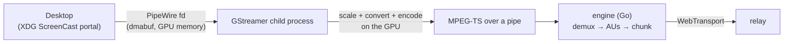

# gawk-broadcast internals

How the native Linux broadcaster actually works. The design decisions
behind all of this live in
[`docs/19`](../../docs/19-linux-native-broadcaster.md) (the milestone
doc), [`docs/28`](../../docs/28-native-broadcaster-audio.md) (audio) and
[`docs/39`](../../docs/39-linux-app-sharing.md) (single-app sharing).

## The pipeline

The shape to hold in your head: **the picture stays on the GPU the whole
way, and the Go code never touches a pixel.** By the time anything reaches
this process it is already H.264 — the app is a byte pump, which is why it
can be simple.



1. **Start dials `/publish` first.** If the relay refuses — wrong secret,
   code taken, at capacity — no share dialog ever appears.
2. **The XDG ScreenCast portal shows your desktop's share dialog** over
   D-Bus. The picker appears on every start — the choice is never
   persisted.
3. **The portal returns a PipeWire fd.** Frames are dmabufs — handles to
   GPU memory, not pixels. Nothing has been copied.
4. **GStreamer runs as a child process**, given that fd, writing MPEG-TS to
   a pipe. It rate-limits (drop-only), scales, converts and encodes on the
   GPU's dedicated encode block — not the CPU, not the shader cores, so it
   doesn't take from the game's frame budget. This is the step the browser
   cannot do on Linux.
5. **The engine splits the TS into access units** (one PES = one frame —
   structural, no start-code guessing), stamps arrival, reads the NAL
   types.
6. **Keyframes go whole on a reliable stream; deltas are sliced into
   datagrams** — exactly the browser broadcaster's design, because the
   bytes are identical.

## Audio

System audio rides the same pipeline: captured from the default output's
*monitor* via PipeWire (not from the portal, which carries no audio),
encoded to Opus by the same GStreamer child, muxed into the same MPEG-TS.
One muxer means **one PTS timeline**, which is the whole A/V sync design:
both media are mapped onto the engine clock by one anchor, so relative
skew is zero by construction. A second pipe would have been less code and
would have reintroduced a constant lip-sync bias nothing can measure.

Audio is **subordinate**: no usable source means video-only and a stats
line that says so; a live pipeline that dies naming an audio element drops
audio and retries the same encoder rung rather than burning the cascade
over a sound card. `-audio=false` is for a broadcaster who wants silence,
not a workaround for breakage.

## Sharing one application

Pick a **window** instead of a screen and two things change:

**The picture is fitted, not stretched.** The configured resolution is a
bounding box: a 4:3 or portrait window keeps its aspect inside it (a
1000×700 window at the 1080p rung encodes 1542×1080). This fixed a live
bug for whole screens too — an ultrawide desktop used to be squashed to
1920×1080 and now encodes 1920×804.

**You are asked whose audio to publish**, and only that application's
sound goes out. The extra click is structural: the portal deliberately
never reveals which application owns the window you picked (no PID, no
name — by privacy design), so window→application correlation does not
exist on Linux. Guessing would risk silently streaming the wrong
application's audio — the worst failure this feature could have — so gawk
asks.

The mechanism is a **tee** (docs/39 D3):

- `gawk-pw-helper` — a small libpipewire client, spawned per broadcast —
  creates a hidden virtual sink (`Audio/Sink/Internal`, so it never
  appears in anyone's device list) and **links** the chosen application's
  output ports into it. PipeWire output ports fan out, so the application
  keeps playing to your speakers and the sink receives a copy. Nothing
  about your audio routing is ever modified; the worst crash leaves a
  hidden idle sink, never silent speakers.
- The GStreamer child captures **one static node forever** — the sink's
  monitor, addressed by `object.serial`. All the dynamism (which
  application, streams dying and reappearing, re-links, a mid-session
  switch) lives outside GStreamer in PipeWire link management, so there
  are no pipeline restarts and no A/V sync model change.
- Cleanup is by construction: every object the helper creates belongs to
  its own connection with no `object.linger`, so the daemon reaps the sink
  and every link when the helper goes away — clean exit, SIGKILL or OOM
  alike.
- Audio stays subordinate: a missing helper, a helper that dies, a sink
  that will not capture — each degrades to system audio or chosen silence
  with a sentence, after the portal grant is already in hand.

## Encoders

Hardware only, probed per machine at startup, **Vulkan first**:

```
vulkanh264enc  →  nvh264enc  →  vah264enc  →  refusal
```

Vulkan Video is the target encode API (docs/19 Decision 21): the only one
spanning RADV, ANV and NVIDIA with no asterisk. NVENC and VAAPI stay
behind it permanently.

**There is no software rung, by decision.** Hardware encode is the entire
reason this app exists; the browser broadcaster already covers software
encode. A machine where nothing passes is told to use the browser, not
quietly degraded to x264 — which would burn the game's CPU budget to
produce a stream the browser could have produced.

Candidates are accepted only by a **real trial encode**, never by the
element being listed: `gst-inspect-1.0` happily lists elements that fail
at runtime on the actual device. Trials encode `videotestsrc`, never the
portal — probing must not pop share dialogs. The last-good encoder is
cached and *re-verified* on the next run, and because a `videotestsrc`
trial can't prove the real path's dmabuf import, **the live start is the
final probe**: a child that dies immediately walks a three-rung capture
ladder — zero-copy (capped) → zero-copy → system memory (`CaptureModes`
in `internal/gst/pipeline.go`) — before advancing to the next encoder,
every retry reusing the portal grant.

## Fixed rung

1080p60, 500 ms GOP. No ladder, no auto-fallback, no mid-session changes:
this engine is hardware-encode by construction, so 1080p60 is coherent
rather than aspirational. The browser's `FallbackController` is
deliberately not ported — its trigger is `encodeQueueSize` growth, and the
hardware finding was that hardware encoders drain frames without that
signal ever firing.

## Layout

```
internal/engine    Session{Start,Stop} + Callbacks + StartError{Phase,Status}
internal/portal    XDG ScreenCast handshake (godbus); picker every start
internal/gst       subprocess supervision + pipeline construction + cascade
internal/fit       aspect-preserving fit; mirrors the Windows crate's fit.rs
internal/appaudio  engine side of the app-audio helper: spawn, protocol, degrade
internal/pwproto   the helper's newline-delimited JSON protocol (both ends)
internal/pwgraph   the helper's brain: registry state, app list, link plan
internal/pwtest    a private headless PipeWire daemon for integration tests
internal/mpegts    TS/PES demux → one AU per PES
internal/fixture   the committed H.264 MPEG-TS test stream, embedded (fixture.TS)
internal/pubsim    fixture demux + looping live-timestamped MediaSource
internal/config    ~/.config/gawk/broadcast.json (0600)
internal/notify    D-Bus notifications with urgency
internal/telemetry telemetry reporter (env GAWK_TELEMETRY_URL); on by
                        default against the default relay, `off` disables
internal/wirecheck golden wire-vector mirror, kept byte-identical to
                        gawk-server/wire and gawk-app/src/transport/wire.ts
internal/app       the GUI's logic, without the GUI
cmd/gawk-broadcast      CLI shell — headless, harness, debug
cmd/gawk-broadcast-gui  GUI shell — Gio window + notifications
cmd/gawk-pw-helper      the app-audio control plane: cgo + libpipewire,
                        creates the capture sink and maintains its links.
                        No media flows through it; if it dies, audio degrades
cmd/gawk-pubsim         synthetic publisher: loops the embedded fixture
                        through the real engine — CI E2E + manual drills; no
                        Gio, no cgo, prints GAWK_PUBSIM_ID=<code> on stdout
```

`Session`/`Callbacks` deliberately mirror the TypeScript
`BroadcastSessionLike`/`BroadcastCallbacks` in
`gawk-app/src/transport/broadcaster.ts`. Same idea, same names, other
language: a second broadcaster only stays survivable if the two remain
legible to each other.

## Testing notes

The app-audio tests start a **private, headless PipeWire daemon** and
drive the real helper against it — the tee, stream churn, and a `kill -9`
matrix that asserts `pw-dump` comes back clean. They need `pipewire`,
`wireplumber`, `pw-cli`/`pw-dump`, `dbus-daemon` and `gst-launch-1.0` on
PATH, plus `libpipewire-0.3-dev` to build the helper at all; without them
they skip rather than fail. CI installs all of it, so the coverage is real
there.

This is the one part of the module CI can genuinely verify. The
portal/GPU half stays structurally invisible to CI (docs/19), which is
why the on-hardware register (docs/39 §6) is what decides the milestone.

The engine's integration tests **build and run the real `gawk-server`**
and publish a committed H.264 fixture through it, then attach a real
subscriber and check what comes out. A hand-written fake relay would only
test the engine against our belief about the relay — the belief most
worth doubting in a second implementation.
