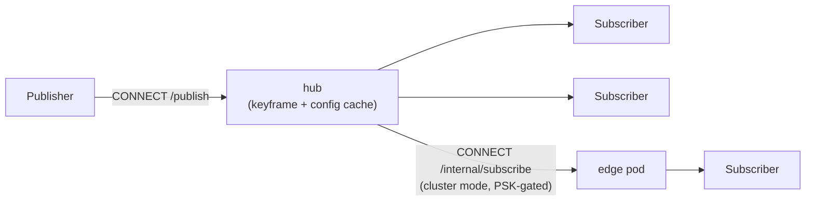

# gawk-server

The Go WebTransport relay for gawk. Publishers (a broadcaster's browser or
a native broadcaster) send encoded video as QUIC datagrams; the relay fans
each broadcast out to its subscribers, caching the latest keyframe and
decoder config to prime late joiners. It runs standalone or, in cluster
mode, as a self-federating fleet of pods that spreads one hot broadcast's
audience across nodes.

Design, wire format and task breakdown:
[`../docs/implementation-tasks.md`](../docs/implementation-tasks.md);
cluster mode: [`../docs/22-relay-scale-out.md`](../docs/22-relay-scale-out.md).



## Routes

| Route | Purpose |
|---|---|
| `CONNECT /publish` | Start a broadcast; the relay mints a new broadcast ID |
| `CONNECT /publish/{id}` | Reclaim an existing ID. A token-bearing reclaim supersedes an active publisher session ("newest publisher wins") |
| `CONNECT /subscribe/{id}` | Watch a broadcast; 429 when full; primed with cached decoder config + last keyframe. `?delivery=reliable` opts into resilient carrier-stream delivery; adding `&buffer=<ms>` upgrades to the DVR ring (clamped to `-dvr-window`) |
| `CONNECT /internal/subscribe/{id}` | Cluster-mode edge pull — one pod dialing another's origin hub. PSK-gated, never exposed publicly |
| `CONNECT /echo` | Connectivity diagnostic (see `gawk-echo` below) |
| `GET /healthz` | Liveness |
| `GET /statusz` | JSON stats: subscribers, frames/datagrams relayed, drops, cached keyframe, per-subscriber detail |

A separate plain-TCP **ops endpoint** serves `GET /metrics` (Prometheus),
`/healthz` and a mirror of `/statusz` on `-metrics-addr` (default `:2112`)
— the main server is HTTP/3-over-UDP only, which Prometheus and plain curl
can't reach. Never expose this port publicly; the Helm chart exposes it via
a ClusterIP Service + optional ServiceMonitor only. Details:
[`../docs/13-observability.md`](../docs/13-observability.md).

## Build & test

```sh
go build ./...
go vet ./...
go test -race ./...
```

## Run

```sh
# Local dev, throwaway (ephemeral in-memory cert; hashes for Chrome are
# logged at startup, and are different on every start):
go run ./cmd/gawk-server -dev-cert

# Local dev, persisted — generate the pair into these paths if absent, load
# them if not. The hash survives restarts, so a join link keeps working:
go run ./cmd/gawk-server -dev-cert -cert-file ../certs/cert.pem -key-file ../certs/key.pem

# Production (cert-manager-provisioned files, reloaded automatically on renewal):
go run ./cmd/gawk-server -cert-file /tls/tls.crt -key-file /tls/tls.key
```

The middle form is what the dev stack runs and what relay work on the host
should use — it presents the same pair the containerised relay does, so the
browser side needs no reconfiguration when you switch between the two. Full
truth table: [`../docs/41`](../docs/41-local-dev-stack.md) §4.2.1.

Verify connectivity from the CLI (`-cert-hash` is logged by the server at
startup; a real CA-issued cert needs no `-cert-hash`):

```sh
go run ./cmd/gawk-echo -cert-hash <cert_hash_hex>
go run ./cmd/gawk-echo -url https://api.gawk.example:4433/echo -origin https://gawk.example
```

(The `-origin` flag matters when the relay runs with `-allowed-origins`.)

## Configuration

Every flag has a `GAWK_*` environment fallback (flag > env > default). The
ones a first install actually touches:

| Flag | Default | Why you'd set it |
|---|---|---|
| `-addr` | `:4433` | Listen address (UDP) |
| `-cert-file` / `-key-file` | (empty) | TLS cert + key; or `-dev-cert` for local dev |
| `-allowed-origins` | allow all | Set to your frontend's origin in any real deployment |
| `-publish-secret` | (empty) | Require a secret to publish |
| `-max-subscribers` / `-max-broadcasts` / `-max-total-subscribers` | 15 / 5 / 50 | Capacity limits |
| `-keepalive-period` | `10s` | Keeps idle viewers connected while the broadcaster is away — this, not `-max-idle-timeout`, is the knob |
| `-metrics-addr` | `:2112` | Ops endpoint; the literal value `off` disables |
| `-cluster-mode` | `false` | Multi-pod federation; requires `-internal-psk` and `-internal-server-name` |

The full table — including DVR, forward parity, telemetry and cluster
keys — with notes on the non-obvious ones:
**[`docs/flags.md`](docs/flags.md)**.

On SIGINT/SIGTERM the server drains before exiting: every open session gets
close code 4002 (clients reconnect immediately), cluster mode releases this
pod's Leases, and the process exits within ~1.5 s.

`cmd/gawk-loadgen` is the synthetic-viewer load tool: N subscribe sessions
against one broadcast, reporting frames/s, keyframes, frameID gaps and
aggregate bitrate:

```sh
go run ./cmd/gawk-loadgen -url https://api.gawk.example:4433 -id K7XQ2M -viewers 200 -duration 60s
```

## Docker

```sh
docker build -f deploy/Dockerfile -t gawk-server:dev .
docker run --rm -d --name gawk -p 4433:4433/udp gawk-server:dev -dev-cert
docker logs gawk 2>&1 | grep cert_hash_hex   # → hash for gawk-echo / the app
```

Distroless static, non-root, ~16 MB. `gawk-echo` is included in the image:
the server is HTTP/3-only, so the Helm chart's k8s probes exec it against
localhost, and it doubles as an in-container diagnostic. There is no shell
in the image — anything exec'd must be a binary path in exec-form.

## Deploy (Helm)

The chart lives in `deploy/charts/gawk-server/` and is published to
`oci://ghcr.io/tuhis/charts/gawk-server`, versioned in lockstep with the
image (chart `version` == `appVersion` == image tag).

```sh
helm upgrade --install gawk-server oci://ghcr.io/tuhis/charts/gawk-server \
  --version <X.Y.Z> -n gawk -f my-values.yaml
```

Values that must be set per install: `certificate.dnsNames`,
`config.allowedOrigins` (the frontend's origin) and `imagePullSecrets` —
see the comments in
[`deploy/charts/gawk-server/values.yaml`](deploy/charts/gawk-server/values.yaml).
Full runbook: [`../docs/05-resilience-deploy.md`](../docs/05-resilience-deploy.md).

`replicas` defaults to `1`; the chart refuses `replicas > 1` unless
`config.clusterMode: true` — without it the hub is an in-memory single-pod
pub/sub and overlapping pods would split the publisher from its
subscribers. The Deployment strategy is `RollingUpdate` (`maxSurge: 1`,
`maxUnavailable: 0`): pods drain one at a time with a Ready replacement
already up before the old one exits, even at `replicas: 1`.
