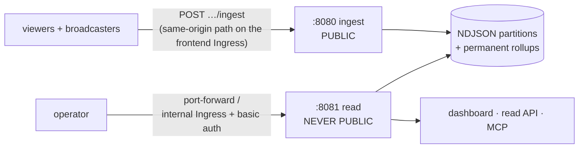

# gawk-telemetry

Optional per-session diagnostics for a gawk relay fleet
([`../docs/33-telemetry-and-diagnostics.md`](../docs/33-telemetry-and-diagnostics.md)).

Every broadcast and every viewer session records what actually happened,
into a store that answers three questions with no human copy-pasting
anything: *how is this stream going right now*, *what was that specific
viewer's experience*, and *how does this compare to the average*.

It adds no measurement — the stats structs already exist client- and
relay-side. This is a pipe, a store and a query surface.

<!-- DASHBOARD SCREENSHOT PLACEHOLDER ─────────────────────────────────────
  Replace this block with:   

  What to capture: the landing view with at least one live broadcast and
  a couple of viewers — ideally one row in a warn/bad state so the
  severity sorting is visible. Blur or crop nothing (there's nothing
  sensitive: keys are obfuscated by design — worth showing off). PNG,
  ~1000 px wide. Commit as gawk-telemetry/docs/assets/dashboard.png.
──────────────────────────────────────────────────────────────────────── -->
> 📸 **Screenshot coming here** — the live fleet view with severity-sorted
> broadcasts and per-viewer status.

## Off by default

Telemetry is gated by the **relay**, not by this service. With no fleet
telemetry key the relay sends no `TelemetryHello` and every client
collects nothing — observably identical to a relay without telemetry
support. Three things have to be enabled together, sharing one key:

```sh
KEY=$(openssl rand -hex 32)
kubectl -n gawk create secret generic gawk-telemetry-key --from-literal=key="$KEY"

# 1. the relay mints session tokens + exposes the headless scrape Service
helm upgrade gawk-server ... \
  --set telemetry.enabled=true \
  --set telemetry.keyRef.name=gawk-telemetry-key --set telemetry.keyRef.key=key

# 2. this service verifies them
helm upgrade --install gawk-telemetry oci://ghcr.io/tuhis/charts/gawk-telemetry -n gawk \
  --set telemetryKeyRef.name=gawk-telemetry-key --set telemetryKeyRef.key=key

# 3. the frontend routes the same-origin ingest path
helm upgrade gawk-app ... --set telemetry.enabled=true
```

An install that leaves all three off renders byte-identically to the
pre-telemetry charts — asserted in CI, not merely intended.

## Two listeners — the split is the security posture



| Listener | Default | Carries | Exposure |
|----------|---------|---------|----------|
| ingest | `:8080` | `POST /api/telemetry/v1/ingest` | **Public**, via a same-origin path on the frontend's Ingress |
| read | `:8081` | dashboard, read API, MCP | **Never public** — ClusterIP, port-forward, or an internal Ingress with basic auth |

The read side aggregates every broadcast on the fleet and should be no
more reachable than the relay's `/statusz`. The chart refuses to render a
read Ingress without basic auth.

```sh
kubectl -n gawk port-forward svc/gawk-telemetry-read 8081:8081
open http://localhost:8081          # the live dashboard
curl localhost:8081/v1/sessions     # the read API
```

## The dashboard

The landing view lists every live broadcast with its broadcaster and each
viewer, severity-sorted, with anything obviously wrong highlighted before
you click anything. Peer sections cover single-session drill-down,
whole-broadcast comparison, history, field explorer, fleet trends, the
rule trace, and a read-only SQL console over the stored partitions.

The full tour — every section, the SQL console's build-tag caveat,
operator notes, the find-a-stream lookup and how tab visibility is
handled: **[`docs/dashboard.md`](docs/dashboard.md)**.

## MCP

The read listener serves MCP at `/mcp` (streamable HTTP). Point Claude
Code at it through the same port-forward:

```json
{ "mcpServers": { "gawk": { "type": "http", "url": "http://localhost:8081/mcp" } } }
```

Start with `diagnose(sessionId)` — it runs the
[bottleneck playbook](../docs/13-observability.md#bottleneck-playbook) and
returns **ranked verdicts with evidence, never raw samples**. A 4-hour
session's diagnosis is under 1 KB; every default response is bounded at
32 KB and a test asserts it. Each piece of evidence is tagged
`relay | client | derived`, and a verdict resting only on client testimony
caps its own confidence — a wedged client's own accounting is the least
reliable evidence in the system, and it is exactly what a wedged client
sends.

## Storage

```
/data/
  sessions/date=2026-07-26/broadcast=<12 hex>/<sessionId>.ndjson[.gz]
  rollups/date=2026-07-26.ndjson          # permanent, one line per session
  relay/date=2026-07-26/<pod>.ndjson[.gz] # scraped relay snapshots
```

Hive-partitioned, so retention is a **directory delete, not a query**, and
DuckDB can read it straight off the PVC. DuckDB is a query option, not a
runtime dependency — the service is plain, cgo-free Go. Raw sessions are
kept 30 days; **rollups are permanent**. Ten viewers × 2 h/day ≈ 5 MB/day.

## Privacy

No IP addresses (the rate limiter uses one and never persists it), no full
user-agent strings (reduced on the device to `"Chrome 152"` /
`"Windows"`), no cross-session or cross-broadcast identity, no
fingerprinting, and never any media. The client never reports the raw
joinable broadcast ID — only the obfuscated key the relay handed it, which
the session token's HMAC binds.

## Build & test

```sh
go build ./...          # cgo-free, no query engine — what a fresh clone gets
go vet ./...
go test -race ./...

# The DEPLOYED configuration. Needs a C toolchain; the image uses exactly this.
go test -tags duckdb ./internal/sqlengine/...

# The image builds from the REPO ROOT (local `replace` on gawk-server/wire):
docker build -f gawk-telemetry/deploy/Dockerfile -t gawk-telemetry:dev ..
```

Dashboard development (hot reload against a live backend), bundle build
rules, and the cgo/build-tag details:
**[`docs/development.md`](docs/development.md)**.

## Flags

Every flag has a `GAWK_TELEMETRY_*` environment fallback
(flag > env > default).

| Flag | Env | Default |
|------|-----|---------|
| `-telemetry-key` | `GAWK_TELEMETRY_KEY` | (required — 64 hex chars, the relay's key) |
| `-ingest-addr` | `GAWK_TELEMETRY_INGEST_ADDR` | `:8080` (public) |
| `-read-addr` | `GAWK_TELEMETRY_READ_ADDR` | `:8081` (never public) |
| `-data-dir` | `GAWK_TELEMETRY_DATA_DIR` | `/data` |
| `-retention-days` | `GAWK_TELEMETRY_RETENTION_DAYS` | `30` (raw only; rollups are permanent) |
| `-scrape-interval` | `GAWK_TELEMETRY_SCRAPE_INTERVAL` | `5s` |
| `-session-idle` | `GAWK_TELEMETRY_SESSION_IDLE` | `2m` |
| `-relay-headless-service` | `GAWK_TELEMETRY_RELAY_HEADLESS` | (empty = client-only telemetry) |
| `-relay-metrics-port` | `GAWK_TELEMETRY_RELAY_PORT` | `2112` |
| `-relay-addrs` | `GAWK_TELEMETRY_RELAY_ADDRS` | (empty; overrides the headless Service) |
| `-dashboard-base` | `GAWK_TELEMETRY_DASHBOARD_BASE` | (empty) |
| `-mcp` | `GAWK_TELEMETRY_MCP` | `true` |
| `-query-sql` | `GAWK_TELEMETRY_QUERY_SQL` | `true` (needs a `-tags duckdb` build to answer) |
| `-stats-key` | `GAWK_TELEMETRY_STATS_KEY` | (empty = the find-a-stream lookup is off) |
| `-read-user` / `-read-password` | `GAWK_TELEMETRY_READ_USER` / `_PASSWORD` | (empty = no auth) |
| `-ingest-rate` / `-ingest-burst` | `GAWK_TELEMETRY_INGEST_RATE` / `_BURST` | `300` / `1200` (global) |
| `-ingest-session-rate` / `-ingest-session-burst` | `GAWK_TELEMETRY_INGEST_SESSION_RATE` / `_SESSION_BURST` | `1` / `10` (per session) |
| `-cors-origin` | `GAWK_TELEMETRY_CORS_ORIGIN` | (empty) |
| `-log-level` | `GAWK_TELEMETRY_LOG_LEVEL` | `info` |
| `-log-format` | `GAWK_TELEMETRY_LOG_FORMAT` | `json` |

The service **refuses to start without a key**: with none it could only
reject everything or accept anything, and neither is a mode worth having.
